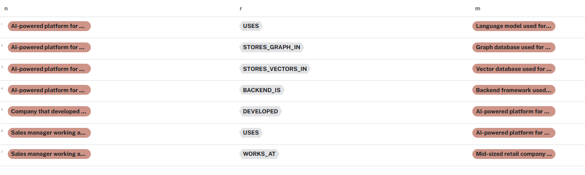
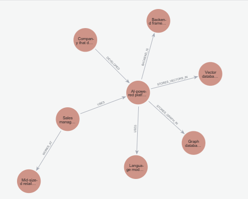

# Graph-RAG System

## 📌 Introduction

Graph-RAG System is an AI-powered CRM automation platform that combines **LLM-based retrieval (RAG)** with a **knowledge graph (Neo4j)** to deliver accurate, non-hallucinating answers. The system is designed to ensure that responses are strictly grounded in uploaded documents and structured relationships, preventing over-guessing and fabricated information.

It integrates:

* Vector-based semantic search (ChromaDB)
* Graph-based reasoning (Neo4j)
* LLM-powered entity & relationship extraction
* A FastAPI backend for document ingestion and querying

---

## 📊 Database Tables Overview

Below is a snapshot of the database tables used in the system, showing how entities and relationships are stored and queried.



The tables represent structured entities extracted from documents and their interconnections, forming the backbone of the Graph-RAG pipeline.

---

## 🧩 Knowledge Graph Visualization

The following image shows the **knowledge graph view**, where nodes and relationships are displayed visually. This graph is used to enrich responses and prevent hallucinations by grounding answers in verified connections.

<p align="center">
  
</p>

The graph is centered and displayed in a square format to clearly highlight entity relationships such as `USES`, `DEVELOPED`, `STORES_GRAPH_IN`, and more.

---

## ⚙️ Project Architecture

* **LLM**: Extracts entities and relationships from uploaded documents
* **Neo4j**: Stores structured knowledge graphs
* **ChromaDB**: Stores vector embeddings for semantic retrieval
* **FastAPI**: Handles API requests for document upload and Q&A

During a query:

1. Relevant document chunks are retrieved from ChromaDB
2. Connected entities and relationships are fetched from Neo4j
3. The final answer is generated using both vector and graph context

---

## ▶️ How to Run the Project

### 1️⃣ Clone the Repository

```bash
git clone https://github.com/...
cd your folder
```

### 2️⃣ Create Virtual Environment

```bash
python -m venv venv
source venv/bin/activate   
```

### 3️⃣ Install Dependencies

```bash
pip install -r requirements.txt
```

### 4️⃣ Start Neo4j

* Make sure Neo4j is login and instances are connected
* Update Neo4j credentials in the `.env` file

### 5️⃣ Run the FastAPI Server

```bash
uvicorn app.main:app --reload
```

### 6️⃣ Access the Application

```bash
* API Docs: `http://localhost:8000/docs`
* Upload documents and start querying the system
```
